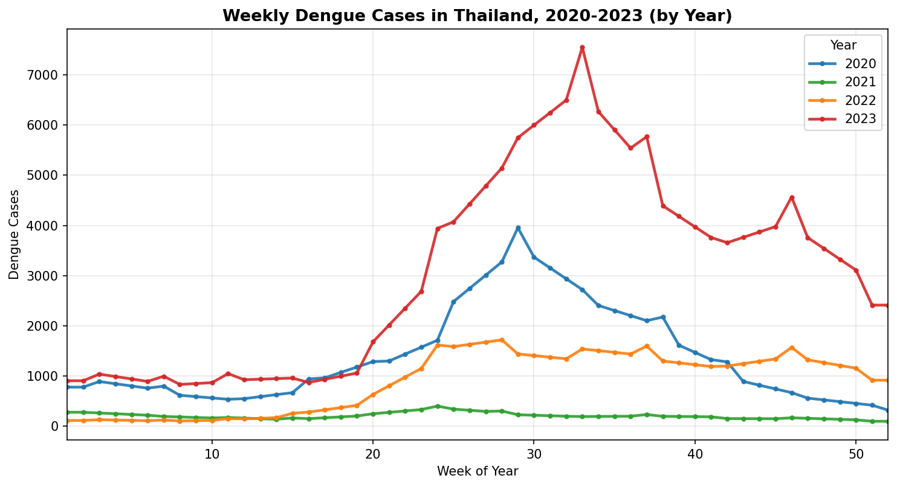
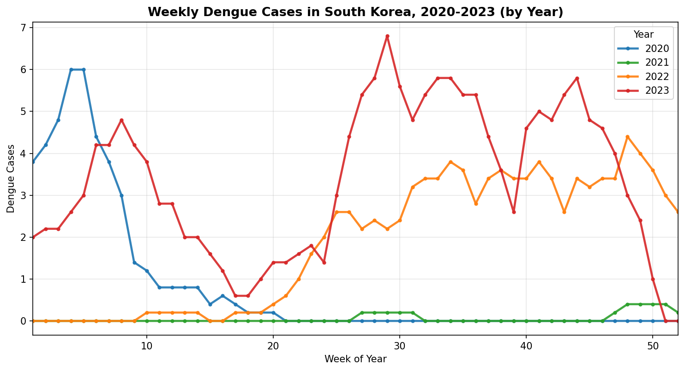
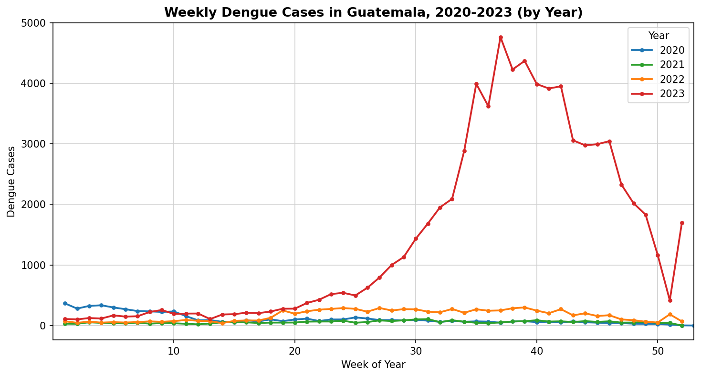
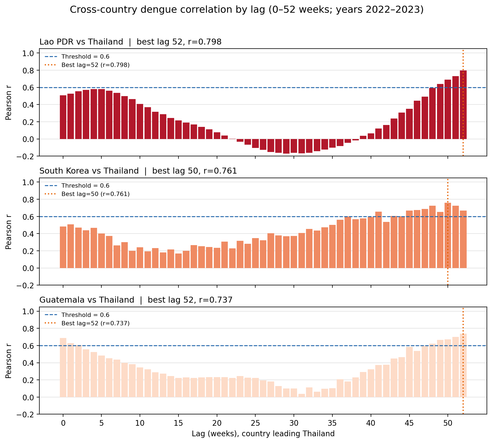
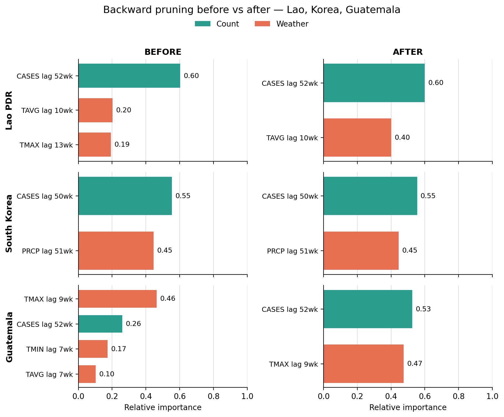
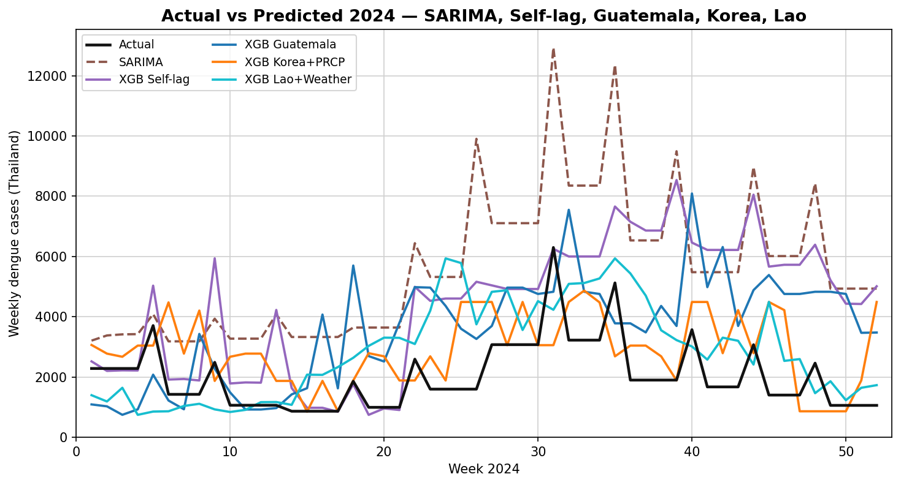

# Forecasting Dengue Fever in Thailand Using Cross-Country Case Correlation and Weather Features

Peerawut Eiamin · Thanin Methiyothin  
Burapha University, Chonburi, Thailand

This repository contains the conference paper draft, figures, **datasets**, and **experiment code** used in  
[`paper/conference-template-a4_Focus.docx`](paper/conference-template-a4_Focus.docx).

**Keywords:** dengue forecasting, time-series analysis, SARIMA, XGBoost, cross-country correlation, weather variables, epidemic surveillance, walk-forward validation.

---

## Overview

Dengue remains a major public health concern in Thailand, where seasonal outbreaks are interrupted by irregular jump years. This study compares one SARIMA baseline and four XGBoost configurations for one-year-ahead weekly forecasting of Thailand dengue cases:

| Configuration | Main features |
|---|---|
| SARIMA | Thailand cases only |
| XGBoost Thailand Self-lag | Thailand self-lags (corr ≥ 0.6) |
| XGBoost Lao PDR | Lao case lag 52 + TAVG lag 10 |
| XGBoost South Korea | Korea case lag 50 + PRCP lag 51 |
| XGBoost Guatemala | Guatemala case lag 52 + TMAX lag 9 |

Primary metrics: **RMSE** and **MAE** on production year **2024**.

---

## Repository layout

```text
Dengue-Forecasting-2026/
├── README.md
├── requirements.txt
├── paper/
│   └── conference-template-a4_Focus.docx
├── figures/                 # Fig. 1–6 (PNG + SVG)
├── tables/                  # Table I–III as CSV
├── dataset/
│   ├── clean_data/
│   │   ├── Dengue_data/     # weekly dengue (normal + timelag)
│   │   └── Weather_data*/   # TMAX/TMIN/TAVG/PRCP
│   └── correlation/         # Thailand self-lag screening CSV
├── code/                    # experiment scripts
├── results/                 # saved predictions / prune tables
└── dengue_final_results/    # SARIMA baseline predictions used by prune script
```

---

## Dataset

| Path | Content |
|---|---|
| `dataset/clean_data/Dengue_data/normal_data/` | Weekly counts: Thailand, Korea, Lao PDR, Guatemala |
| `dataset/clean_data/Dengue_data/timelag_data/` | Dengue lag_0…lag_52 (2020–2024), including all OpenDengue countries used in the 16-country screen |
| `dataset/clean_data/Weather_data_2019_2024/` | Weekly weather for Thailand, Lao PDR, Guatemala (+ timelag tables) |
| `dataset/clean_data/Weather_data/` | South Korea weekly weather (+ cleaned fallback) |
| `dataset/correlation/04_thailand_selflag_correlation_2022_2023.csv` | Thailand self-lag corr ≥ 0.6 screen |

**Sources (paper):** Thailand cases — ASEAN–South Korea GFID / Burapha AIDA; other countries — OpenDengue; weather — NOAA / GHCN.

---

## Experiment code

Install dependencies from the repo root:

```bash
pip install -r requirements.txt
```

| Script | Role | Output |
|---|---|---|
| [`code/sarima_walkforward_clean.py`](code/sarima_walkforward_clean.py) | SARIMA Box–Jenkins + walk-forward (val 2023 → prod 2024) | `results/sarima/` |
| [`code/xgboost_thailand_self.py`](code/xgboost_thailand_self.py) | XGBoost Thailand Self-lag | `results/thailand_self/` |
| [`code/xgboost_thailand_self_pruning.py`](code/xgboost_thailand_self_pruning.py) | Self-lag backward pruning | `results/thailand_self_pruning/` |
| [`code/run_16countries_prune_vs_sarima.py`](code/run_16countries_prune_vs_sarima.py) | Correlation screen → prune weather → retune → vs SARIMA | `results/prune_vs_sarima/` |
| [`code/xgboost_hyperparam_tuning.py`](code/xgboost_hyperparam_tuning.py) | Optional legacy hyperparameter sweep | `results/hyperparam_tuning/` |

See [`code/README.md`](code/README.md) for full run notes.

**Pre-computed paper results** (no retrain needed):

- `results/thailand_self/` — Self-lag 2024 predictions / metrics  
- `results/countries/{lao,south_korea,guatemala}/` — prune paths + best predictions  
- `tables/` — Tables I–III  
- `dengue_final_results/analysis_8_sarima_walkforward/predictions_2024.csv` — SARIMA production forecast  

---

## 1. Introduction

In Thailand, dengue cases rise in the rainy season, with abnormal jump years every few years.  
Fig. 1 shows weekly Thai counts for 2020–2023; **2023** was a major outbreak year.

Similar 2023 spikes appear in **South Korea** and **Guatemala** (Figs. 2–3), consistent with broader regional synchrony. The study asks whether lagged dengue counts — and selected weather variables — from one well-correlated country can improve Thailand forecasts beyond domestic self-lags.

### Fig. 1 — Thailand, 2020–2023



*Weekly dengue case counts in Thailand, 2020–2023 (shown by year).*  
SVG: [`figures/fig1_thailand_2020_2023_by_year.svg`](figures/fig1_thailand_2020_2023_by_year.svg)

### Fig. 2 — South Korea, 2020–2023



*Weekly dengue case counts in South Korea, 2020–2023.*  
SVG: [`figures/fig2_korea_2020_2023_by_year.svg`](figures/fig2_korea_2020_2023_by_year.svg)

### Fig. 3 — Guatemala, 2020–2023



*Weekly dengue case counts in Guatemala, 2020–2023.*  
SVG: [`figures/fig3_guatemala_2020_2023_by_year.svg`](figures/fig3_guatemala_2020_2023_by_year.svg)

---

## 2. Methods

### 2.1 Data Collection and Lag Construction

| Source | Content |
|---|---|
| ASEAN–South Korea Collaborative Platform for GFID (Burapha University) | Thailand weekly dengue cases |
| OpenDengue | Other-country dengue cases |
| NOAA | Weather: TMAX, TMIN, TAVG, PRCP |

- Thai monthly totals were disaggregated to weekly values.
- Country-count lags: weeks **2–52**
- Weather lags: weeks **0–52**

### 2.2 Feature Selection via Cross-Correlation Analysis

Pearson correlations were computed on **2022–2023 only**.

- Keep the **best lag** = largest absolute correlation
- Require lag ≥ **2** weeks and |r| ≥ **0.6**
- Weather variables use the same absolute-correlation gate

Selected country settings after screening (and pruning focus):

| Country | Best lag | Pearson r (vs Thailand) |
|---|---:|---:|
| Lao PDR | 52 | 0.798 |
| South Korea | 50 | 0.761 |
| Guatemala | 52 | 0.737 |

Thailand Self-lag starts from Thai lags with self-correlation ≥ 0.6 (14 lags).

### Fig. 4 — Correlation by lag (0–52)



*Pearson correlation of Lao PDR, South Korea, and Guatemala dengue counts with Thailand across lags 0–52 weeks (2022–2023). Dashed line = threshold 0.6; dotted line = best lag.*  
SVG: [`figures/fig4_correlation_by_lag.svg`](figures/fig4_correlation_by_lag.svg)

### 2.3 Feature Refinement via Backward Pruning

After screening, each XGBoost feature set was refined by backward pruning:

1. Train the model  
2. Rank features by gain-based importance  
3. Drop the weakest weather feature (count lag is kept as the main signal)  
4. Retrain and record RMSE / MAE  
5. Repeat until only the count lag remains  
6. Keep the step with the **lowest RMSE**

Final retained sets:

- **Lao PDR:** count lag 52 + TAVG lag 10 (dropped TMAX lag 13)  
- **South Korea:** count lag 50 + PRCP lag 51 (no temperature variables passed |r| ≥ 0.6)  
- **Guatemala:** count lag 52 + TMAX lag 9 (dropped weaker temperature lags)  
- **Thailand Self-lag:** 14 self-lags (no weather to prune)

### Fig. 5 — Feature importance before vs after pruning



*Feature importance before (left) and after (right) backward pruning for Lao PDR, South Korea, and Guatemala.*  
SVG: [`figures/fig5_pruning_before_after.svg`](figures/fig5_pruning_before_after.svg)

### Table I — Backward pruning steps

CSV: [`tables/table1_backward_pruning_steps.csv`](tables/table1_backward_pruning_steps.csv)

| Configuration | Step | Features Used | RMSE | MAE | Selected |
|---|---:|---|---:|---:|---|
| Lao PDR | 1 | count52, TMAX13, TAVG10 | 2229 | 1803 | No |
| Lao PDR | **2** | **count52, TAVG10** | **1974** | **1526** | **Yes** |
| Lao PDR | 3 | count52 only | 2103 | 1571 | No |
| South Korea | **1** | **count50, PRCP51** | **2020** | **1567** | **Yes** |
| South Korea | 2 | count50 only | 2609 | 2200 | No |
| Guatemala | 1 | count52, TMAX9, TMIN7, TAVG7 | 2455 | 1897 | No |
| Guatemala | 2 | count52, TMAX9, TMIN7 | 2469 | 1911 | No |
| Guatemala | **3** | **count52, TMAX9** | **2379** | **2065** | **Yes** |
| Guatemala | 4 | count52 only | 3991 | 3422 | No |

### 2.4 Prediction Configurations and Walk-Forward Parameter Selection

Models: **SARIMA** and **XGBoost**.

After features were fixed, hyperparameters were selected by walk-forward validation:

- **Tune:** train 2021–2022 → validate **2023** (lowest validation RMSE)
- **Production:** retrain 2022–2023 with those parameters → forecast **2024**

Primary metrics: **RMSE** and **MAE**.

### Table II — Best parameters (validate 2023)

CSV: [`tables/table2_best_parameters_val2023.csv`](tables/table2_best_parameters_val2023.csv)

| Configuration | Best Parameters | Val. RMSE (2023) |
|---|---|---:|
| SARIMA | (1,1,1)(0,1,1)[52] | 2,105 |
| XGBoost Thailand Self-lag | n=200, depth=2, lr=0.1 | 2,334 |
| XGBoost Guatemala | n=600, depth=3, lr=0.1 | 3,501 |
| XGBoost Lao PDR | n=200, depth=3, lr=0.02 | 3,509 |
| XGBoost Korea | n=200, depth=2, lr=0.02 | 3,572 |

---

## 3. Results

### Table III — Production forecasting results for 2024

CSV: [`tables/table3_production_results_2024.csv`](tables/table3_production_results_2024.csv)

| Configuration | RMSE | MAE |
|---|---:|---:|
| SARIMA | 3,965 | 3,565 |
| XGBoost Thailand Self-lag | 2,968 | 2,344 |
| XGBoost Guatemala | 2,331 | 1,996 |
| XGBoost Lao PDR | 1,730 | 1,407 |
| **XGBoost Korea** | **1,622** | **1,293** |

**Korea (precipitation)** achieved the lowest RMSE (1,622), followed by **Lao PDR (weather)** (1,730). Guatemala (2,331) also beat both Thailand-only baselines (Self-lag 2,968; SARIMA 3,965).

### Fig. 6 — Actual vs predicted, Thailand 2024



*Actual versus predicted weekly dengue case counts for Thailand in 2024 (SARIMA, Self-lag, Guatemala, Korea, Lao).*  
SVG: [`figures/fig6_actual_vs_predicted_2024.svg`](figures/fig6_actual_vs_predicted_2024.svg)

---

## 4. Discussion (summary)

- Cross-country XGBoost configurations with a small pruned weather set outperform Thailand-only baselines on absolute error.
- South Korea gave the strongest forecasts overall, even though its weather screen retained only **precipitation** (TMAX / TMIN / TAVG did not pass |r| ≥ 0.6).
- Lao PDR (endemic neighbor) and Guatemala (import-driven / outbreak year) also improve on Self-lag and SARIMA.
- Validation RMSE (2023 outbreak year) and production RMSE (2024) can appear “opposite” in ranking because 2023 is an extreme year and the walk-forward roles of those years differ — production performance on 2024 is the main reported result.

---

## 5. Conclusion (summary)

Using walk-forward parameter selection and 2024 production testing, XGBoost configurations based on Lao PDR and South Korea dengue counts plus one weather covariate provide the most accurate one-year-ahead absolute-error forecasts among the compared models, with Guatemala as an additional competitive country setting.

---

## Paper file

| File | Description |
|---|---|
| [`paper/conference-template-a4_Focus.docx`](paper/conference-template-a4_Focus.docx) | Conference manuscript (A4 template Focus revision) |

---

## Citation / data sources (from paper)

1. Wilder-Smith & Schwartz, *NEJM*, 2005  
2. WHO, Ten threats to global health in 2019  
3. García-Carreras et al., *PLOS Biology*, 2022  
4. van Panhuis et al., *PNAS*, 2015  
5. Mordecai et al., *PLOS Neglected Tropical Diseases*, 2017  
6. ASEAN–South Korea Collaborative Platform for GFID Project, Burapha University — [AIDA](https://aida.informatics.buu.ac.th/)  
7. Clarke et al., OpenDengue, *Scientific Data*, 2024  
8. NOAA / GHCN daily weather  
9. Box et al., *Time Series Analysis*, 2015  
10. Chen & Guestrin, XGBoost, *KDD*, 2016  
11. Johansson et al., infectious-disease forecast evaluation  

---

## License

Paper and figures are provided for academic / conference use associated with this project.  
Please contact the authors before redistribution of the manuscript text.
